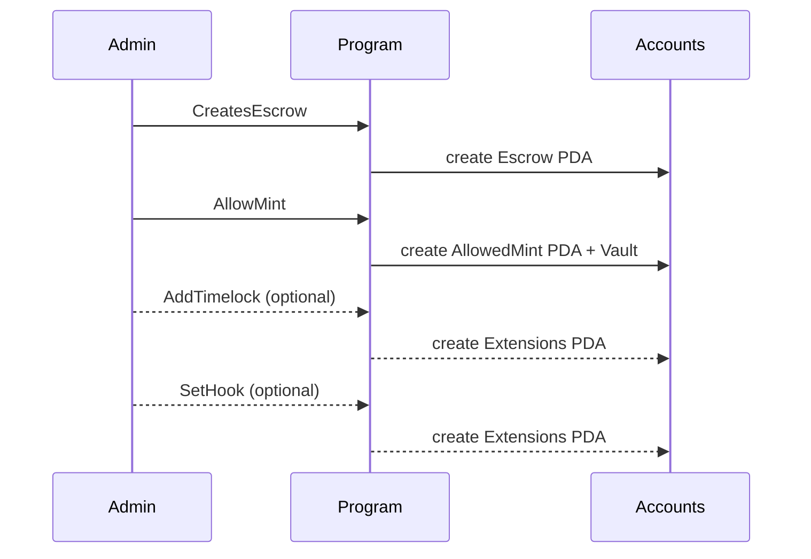
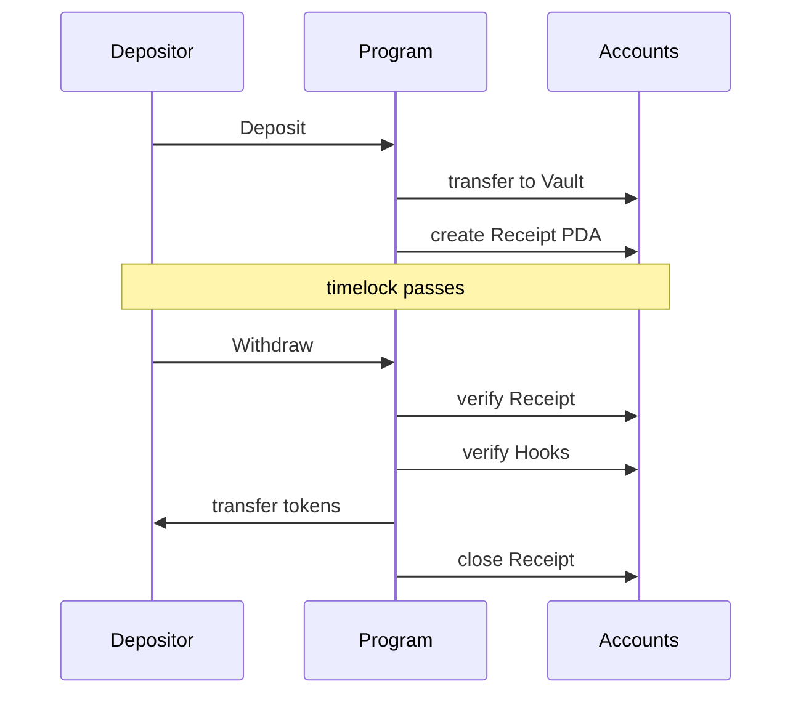

# Escrow Program

[](LICENSE)
[](https://github.com/solana-program/pinocchio)
[](https://solana.com)

> **SECURITY NOTICE**: This program has not been audited. Use at your own risk. Not recommended for production use with real funds without a thorough security review.

## Program ID

```
Escrowae7RaUfNn4oEZHywMXE5zWzYCXenwrCDaEoifg
```

## Deployments

| Network                                                                                                   | Program ID                                     |
| --------------------------------------------------------------------------------------------------------- | ---------------------------------------------- |
| [Devnet](https://explorer.solana.com/address/Escrowae7RaUfNn4oEZHywMXE5zWzYCXenwrCDaEoifg?cluster=devnet) | `Escrowae7RaUfNn4oEZHywMXE5zWzYCXenwrCDaEoifg` |

## Overview

A configurable escrow program for Solana that enables receipt-based token deposits and withdrawals. Admins create escrows and allowlist specific mints, while depositors receive receiptse that can be redeemed after optional lock mechanisms (e.g., timelocks, hooks, etc.) are satisfied.

## Key Features

- **Receipt-based deposits** - Each deposit creates a unique receipt PDA for tracking
- **Per-escrow mint allowlisting** - Admins control which tokens can be deposited
- **Token-2022 extension blocking** - Optionally block mints with specific extensions (PermanentDelegate, NonTransferable, Pausable, etc.)
- **Configurable timelocks** - Set lock durations that must pass before withdrawals
- **Custom hook programs** - Invoke external programs pre/post deposit and withdrawal

## Account Types

| Account          | PDA Seeds                                            | Description                                                 |
| ---------------- | ---------------------------------------------------- | ----------------------------------------------------------- |
| Escrow           | `["escrow", escrow_seed]`                            | Main escrow config (admin, bump)                            |
| Receipt          | `["receipt", escrow, depositor, mint, receipt_seed]` | Deposit record with amount and timestamp                    |
| AllowedMint      | `["allowed_mint", escrow, mint]`                     | Marker that a mint is allowed                               |
| EscrowExtensions | `["extensions", escrow]`                             | TLV-encoded extensions (timelock, hook, blocked extensions) |

## Workflow





## Documentation

- [Program Overview](docs/PROGRAM_OVERVIEW.md) - Instructions, accounts, and technical reference
- [CU Benchmarks](docs/CU_BENCHMARKS.md) - Compute unit usage per instruction
- [Improvements](docs/IMPROVEMENTS.md) - Possible future enhancements

## Local Development

### Prerequisites

- Rust
- Node.js (see `.nvmrc`)
- pnpm (see `package.json` `packageManager`)
- Solana CLI

All can be conveniently installed via the [Solana CLI Quick Install](https://solana.com/docs/intro/installation).

### Client Examples

Check out the [TypeScript demo](examples/typescript/escrow-demo/README.md) for a complete example of the escrow program in action.

### Build & Test

```bash
# Install dependencies
just install

# Full build (IDL + clients + program)
just build

# Run integration tests
just integration-test

# Format and lint
just fmt
```

## Tech Stack

- **[Pinocchio](https://github.com/anza-xyz/pinocchio)** - Lightweight `no_std` Solana framework
- **[Codama](https://github.com/codama-idl)** - IDL-driven client generation
- **[LiteSVM](https://github.com/LiteSVM/litesvm)** - Fast local testing

---

Built and maintained by the [Solana Foundation](https://solana.org/).

Licensed under MIT. See [LICENSE](LICENSE) for details.

## Support

- [**Solana StackExchange**](https://solana.stackexchange.com/) - tag `escrow-program`
- [**Open an Issue**](https://github.com/solana-program/escrow/issues/new)
