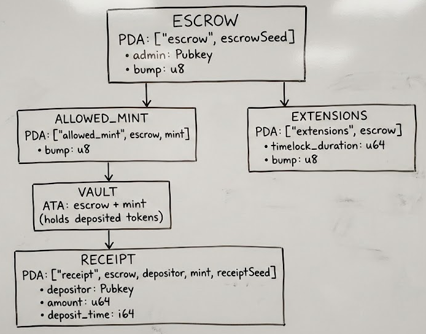

# Escrow Program TypeScript Demo

An executable demonstration of the full escrow workflow using `@solana/kit` and the generated escrow program client.

## Overview

This demo showcases the escrow program's core functionality:

- **Initialize** an escrow account with an admin keypair
- **Hold tokens** with optional timelock protection
- **Allow specific mints** for deposits
- **Deposit tokens** to receive a receipt
- **Withdraw tokens** after timelock expires

## Prerequisites

1. **Node.js** (v24+ recommended)
2. **pnpm** (v10.15.1+ recommended)
3. **Built program** (from repo root: `just build`)
4. [**Solana CLI**](https://solana.com/docs/intro/installation) (v2.2+ recommended) - for running a local validator

## Quick Start

```bash
# Build the program
just build

# Generate the client
just generate-clients

# Navigate to the demo directory
cd examples/typescript/escrow-demo

# Install dependencies
pnpm install

# Run the demo with a local validator
pnpm start-with-validator
```

The `start-with-validator` script starts a local validator with the escrow program preloaded, runs the demo, and kills the validator after the demo completes. Alternatively, you can start your local validator separately and run the demo by running `pnpm start`.

## Architecture

### Account Relationships



## Step-by-Step Walkthrough

We have created a few helper functions/files to make the demo easier to follow:

- `src/utils/config.ts`: Configuration constants for the escrow demo
- `src/utils/logging.ts`: Helper functions for logging
- `src/utils/token-setup.ts`: Helper functions for creating mint instructions
- `src/utils/transaction.ts`: Helper functions for building and sending transactions

### Step 1: Setup & Connect

Connect to localhost validator and generate keypairs:

```typescript
import { createDefaultLocalhostRpcClient } from '@solana/kit-plugins';
import { generateKeyPairSigner } from '@solana/kit';

const { rpc, rpcSubscriptions, payer } = await createDefaultLocalhostRpcClient();
const admin = await generateKeyPairSigner();
const escrowSeed = await generateKeyPairSigner();
const receiptSeed = await generateKeyPairSigner();
const mintKeypair = await generateKeyPairSigner();
```

Note that we are using the `createDefaultLocalhostRpcClient` [plugin](https://github.com/anza-xyz/kit-plugins) to create an RPC client with the default localhost settings. The plugin also airdrops SOL to a `payer` signer for us.

### Step 2: Create Escrow

Create a new escrow account with the admin keypair and the randomly generated escrow seed:

```typescript
import { getCreatesEscrowInstructionAsync, findEscrowPda } from '@solana/escrow-program-client';

// Find the escrow PDA
const [escrowPda, escrowBump] = await findEscrowPda({
    escrowSeed: escrowSeed.address,
});

// Build instruction
const createEscrowIx = await getCreatesEscrowInstructionAsync({
    payer,
    admin,
    escrowSeed,
});
```

In production, make sure to store the escrow seed and PDA locations so you are able to use the escrow account again in the future.

### Step 3: Create Test Token

Create a classic SPL Token mint and fund the depositor's ATA:

```typescript
import { getInitializeMintInstruction } from '@solana-program/token';

// Create mint with 6 decimals
const mintIxs = await createMintInstructions(
    payer,
    mintKeypair,
    payer.address, // payer is mint authority
    CONFIG.TOKEN_DECIMALS,
    rpc,
);

const createDepositorAtaIx = await getCreateAssociatedTokenIdempotentInstructionAsync({
    ata: depositorAta,
    mint: mintKeypair.address,
    owner: payer.address,
    payer,
});

// Mint tokens to depositor
const mintToIx = getMintToInstruction({
    amount: CONFIG.MINT_AMOUNT,
    mint: mintKeypair.address,
    mintAuthority: payer,
    token: depositorAta,
});
```

### Step 4: Allow Mint

Allow the mint for deposits into this escrow (we must include the admin keypair as a signer):

```typescript
import { getAllowMintInstructionAsync } from '@solana/escrow-program-client';

const allowMintIx = await getAllowMintInstructionAsync({
    admin,
    escrow: escrowPda,
    mint: mintKeypair.address,
    payer,
});
```

This creates:

- `AllowedMint` PDA account
- Vault ATA (escrow's token account for this mint)

### Step 5: Add Timelock

Add a 2-second timelock extension. This will force that tokens are locked for at least 2 seconds before they can be withdrawn:

```typescript
import { getAddTimelockInstructionAsync } from '@solana/escrow-program-client';

const addTimelockIx = await getAddTimelockInstructionAsync({
    admin,
    escrow: escrowPda,
    lockDuration: CONFIG.TIMELOCK_DURATION,
    payer,
});
```

For this demo, we will attempt to withdraw before the timelock expires to see the expected error; and then wait for the timelock to expire and withdraw successfully.

### Step 6: Deposit

Deposit 100 tokens into the escrow:

```typescript
import { getDepositInstructionAsync } from '@solana/escrow-program-client';

const depositIx = await getDepositInstructionAsync({
    amount: CONFIG.DEPOSIT_AMOUNT,
    depositor: payer,
    escrow: escrowPda,
    mint: mintKeypair.address,
    payer,
    receiptSeed,
});
```

This creates a `Receipt` PDA that tracks:

- Who deposited (withdrawer)
- How much
- When (for timelock calculation)

### Step 7: Early Withdraw (Expected Failure)

Attempting to withdraw before timelock expires. For this demo, we need to wrap in a try/catch to catch the expected error (error code 0x3: TimelockNotExpired, see [errors.rs](../../../program/src/errors.rs)):

```typescript
try {
    const earlyWithdrawIx = await getWithdrawInstructionAsync({
        escrow: escrowPda,
        mint: mintKeypair.address,
        payer,
        receipt: receiptPda,
        rentRecipient: payer.address,
        withdrawer: payer,
    });

    await buildAndSend({ instructions: [earlyWithdrawIx], payer, rpc, rpcSubscriptions, skipComputeEstimate: true });
    // this transaction should fail
} catch (error) {
    if (
        isSolanaError(error) &&
        'code' in error.context &&
        error.context.code === ESCROW_PROGRAM_ERROR__TIMELOCK_NOT_EXPIRED
    ) {
        // we expect this
    } else {
        // this is unexpected--throw the error so we can see it
        throw error;
    }
}
```

### Step 8: Wait & Withdraw

After waiting for timelock to expire, we can try withdrawing again:

```typescript
await sleep(CONFIG.TIMELOCK_WAIT_MS);

const withdrawIx = await getWithdrawInstructionAsync({
    escrow: escrowPda,
    mint: mintKeypair.address,
    payer,
    receipt: receiptPda,
    rentRecipient: payer.address,
    withdrawer: payer,
});

await buildAndSend({ instructions: [withdrawIx], payer, rpc, rpcSubscriptions });
```

This should succeed.

## Expected Output

If everything goes well, you should see the following output:

```
══════════════════════════════════════════════════
  ESCROW PROGRAM DEMO
══════════════════════════════════════════════════

[1/8] Setup & Connect
━━━━━━━━━━━━━━━━━━━━━━━━━━━━━━━━━━━━━━━━━━━━━━━━━━
  → Payer: BhRDdzyV...
  → Admin: RJpydD5w...
  ✓ Connected to localhost validator

[2/8] Create Escrow
━━━━━━━━━━━━━━━━━━━━━━━━━━━━━━━━━━━━━━━━━━━━━━━━━━
  → Escrow Seed: EZf9Z5SM...
  → Escrow PDA: 6RMVLoai...
  → Bump: 252
  ✓ Escrow created

[3/8] Create Test Token (Classic SPL Token)
━━━━━━━━━━━━━━━━━━━━━━━━━━━━━━━━━━━━━━━━━━━━━━━━━━
  → Mint: Eavsy6qk...
  → Depositor ATA: A2TjhhDb...
  → Minted: 1000 tokens
  ✓ Test token created and minted

[4/8] Allow Mint
━━━━━━━━━━━━━━━━━━━━━━━━━━━━━━━━━━━━━━━━━━━━━━━━━━
  → Allowed Mint PDA: 7ag8XofH...
  → Vault ATA: CxrVptTS...
  ✓ Mint allowed for escrow deposits

[5/8] Add Timelock Extension
━━━━━━━━━━━━━━━━━━━━━━━━━━━━━━━━━━━━━━━━━━━━━━━━━━
  → Extensions PDA: C38LFr8x...
  → Lock Duration: 2 seconds
  ✓ Timelock extension added

[6/8] Deposit Tokens
━━━━━━━━━━━━━━━━━━━━━━━━━━━━━━━━━━━━━━━━━━━━━━━━━━
  → Receipt PDA: BgzSKCRh...
  → Deposit Amount: 100 tokens
  → Vault Balance: 100 tokens
  ✓ Deposit successful

[7/8] Attempt Early Withdraw
━━━━━━━━━━━━━━━━━━━━━━━━━━━━━━━━━━━━━━━━━━━━━━━━━━
  → Action: Trying to withdraw before timelock expires...
  ✗ Withdraw failed as expected: Timelock not expired

[8/8] Wait for Timelock & Withdraw
━━━━━━━━━━━━━━━━━━━━━━━━━━━━━━━━━━━━━━━━━━━━━━━━━━
  → Waiting: 2.5 seconds...
  → Final Depositor Balance: 1000 tokens
  ✓ Withdraw successful!

══════════════════════════════════════════════════

  Demo completed successfully!

  Summary:
    - Created escrow: 6RMVLoai...
    - Test mint: Eavsy6qk...
    - Deposited: 100 tokens
    - Timelock: 2 seconds
    - Withdrew: 100 tokens

══════════════════════════════════════════════════
```

## Support

- [**Solana StackExchange**](https://solana.stackexchange.com/) - tag `escrow-program`
- [**Open an Issue**](https://github.com/solana-program/escrow/issues/new)
